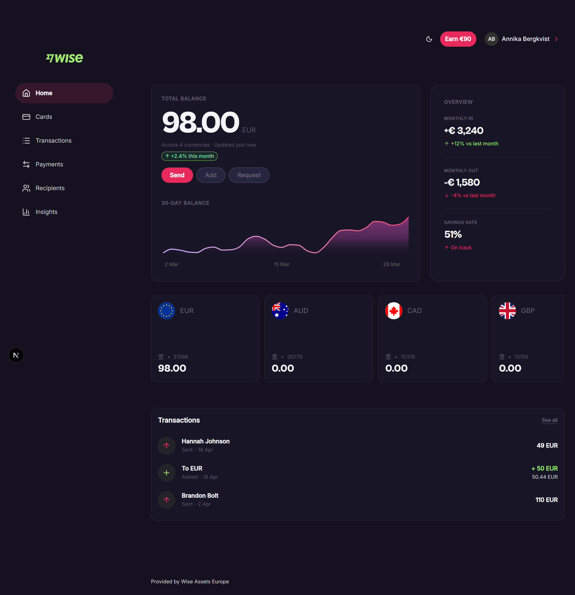
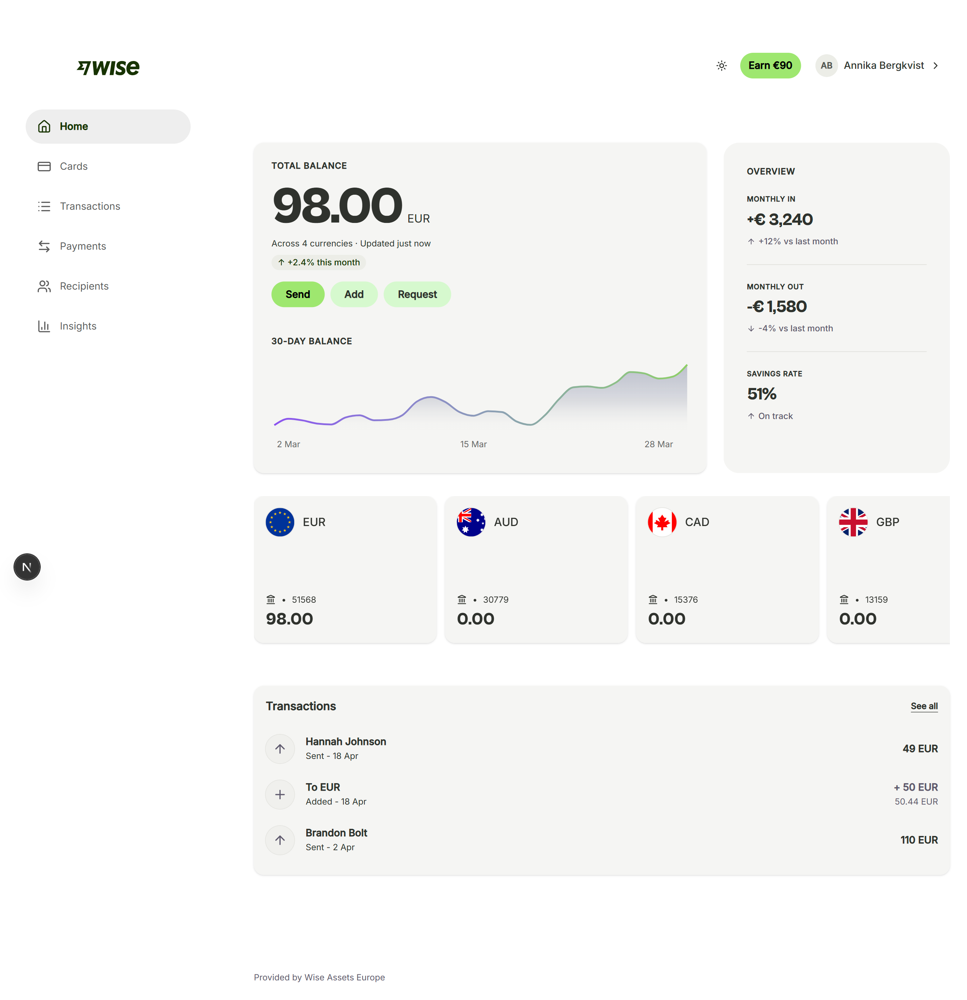

# Wise Dashboard UI — Design Engineer Project

A Wise-inspired dashboard UI, redesigned and built from scratch as a design engineering exercise. The goal was to move beyond static mockups and implement a real, interactive UI using a production-ready component architecture — the same stack used in modern product teams.

**Live demo →** [fintech-dashboard-ui-six.vercel.app](https://fintech-dashboard-ui-six.vercel.app)

---

## What this project demonstrates

- Translating a complex, real-world product UI into clean, maintainable component code
- Setting up and customising a design system using shadcn/ui and Tailwind CSS 4
- Implementing semantic colour tokens with full light and dark mode support
- Structuring a Next.js App Router project the way a product team would
- Thinking in components — knowing what to make reusable vs what to keep local

---

## Stack

| | |
|---|---|
| **Next.js** (App Router) | Framework |
| **shadcn/ui** | Radix-based accessible components |
| **Tailwind CSS 4** | Utility-first styling |
| **Recharts** | Area chart for balance history |
| **TypeScript** | Type safety throughout |

---

## Project structure
src/
├── app/
│   ├── layout.tsx                    # Root layout: sidebar, header, fonts
│   ├── page.tsx                      # Dashboard: balance, currency cards, transactions
│   └── globals.css                   # Design tokens — colours, radius, dark mode
│
├── components/
│   ├── app-header.tsx                # Top bar: logo, earn button, user menu
│   ├── app-sidebar.tsx               # Left nav with expandable Payments submenu
│   ├── mode-toggle.tsx               # Light/dark mode toggle
│   ├── theme-provider.tsx            # next-themes provider wrapper
│   ├── total-balance-area-chart.tsx  # Recharts area chart — 30-day balance
│   └── ui/                           # shadcn primitives: button, card, badge, avatar…
│
├── hooks/
│   └── use-mobile.ts                 # Responsive sidebar behaviour
│
└── lib/
└── utils.ts                      # cn() helper

---

## Design decisions

**Tokens over hardcoded values** — all colours live as CSS variables in `globals.css`. Tailwind and shadcn read them via `@theme`, which means switching the entire theme is a one-file change.

**Semantic naming** — variables like `--primary`, `--muted`, `--sidebar-accent` describe *intent*, not appearance. This makes dark mode straightforward and keeps components decoupled from specific colour values.

**shadcn as a starting point, not a constraint** — component variants and base styles are edited directly (that's the point of shadcn). The UI primitives in `src/components/ui/` are owned code, not a locked library.

---

## Key files to look at

| What | Where |
|---|---|
| Colour tokens, dark mode, radius | `src/app/globals.css` |
| Dashboard layout and content | `src/app/page.tsx` |
| Sidebar navigation | `src/components/app-sidebar.tsx` |
| Header | `src/components/app-header.tsx` |
| Balance chart | `src/components/total-balance-area-chart.tsx` |
| Button variants | `src/components/ui/button.tsx` |
| Card styles | `src/components/ui/card.tsx` |

---

## About

Built by [Annika Bergkvist](https://annika-b.webflow.io) — Design Engineer based in Sweden, bridging product design and frontend development.

[LinkedIn](https://www.linkedin.com/in/annikabergkvist/) · [GitHub](https://github.com/annikabergkvist)
